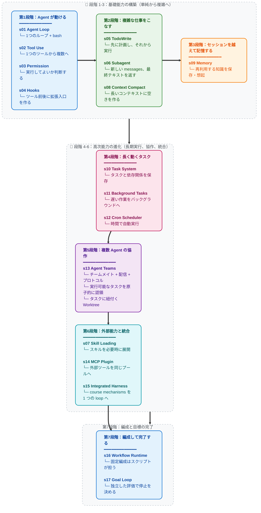

# Learn Claude Code -- 真の Agent のための Harness Engineering

[English](./README.md) | [中文](./README-zh.md) | [日本語](./README-ja.md)

## Go + OpenAI 移行版

元の段階的なコース構成を保ちながら、実行可能な実装を Go に統一し、
OpenAI Responses API の function calling を利用します。各レッスンは
`go run ./sXX_xxx`、共通 runtime は `internal/` から実行できます。
これは [shareAI-lab/learn-claude-code](https://github.com/shareAI-lab/learn-claude-code)
のチュートリアル構成と MIT ライセンスの内容を Go/OpenAI に移植したものです。

## Agency はモデルから生まれる。Agent プロダクト = モデル + Harness

コードの話をする前に、一つ明確にしておく。

**Agency -- 知覚し、推論し、行動する能力 -- はモデルの訓練から生まれる。外部コードの編成からではない。** だが実際に動く Agent プロダクトには、モデルと Harness の両方が必要だ。モデルはドライバー、Harness は車。本リポジトリは車の作り方を教える。

### Agency はどこから来るか

Agent の核心にあるのはニューラルネットワークだ -- Transformer、RNN、学習された関数 -- 数十億回の勾配更新を経て、行動系列データの上で環境を知覚し、目標を推論し、行動を起こすことを学んだもの。Agency は周囲のコードから与えられるものではない。訓練を通じてモデルが獲得するものだ。

人間が最もわかりやすい例だ。数百万年の進化的訓練によって形作られた生物的ニューラルネットワーク。感覚で世界を知覚し、脳で推論し、身体で行動する。DeepMind、OpenAI、Anthropic が "Agent" と言うとき、その核心は常に同じことを指している：**訓練によって行動を学んだモデルと、それを特定の環境で機能させるインフラの組み合わせ。**

歴史がその証拠を刻んでいる：

- **2013 -- DeepMind DQN が Atari をプレイ。** 単一のニューラルネットワークが、生のピクセルとスコアだけを受け取り、7 つの Atari 2600 ゲームを学習 -- すべての先行アルゴリズムを超え、3 つで人間の専門家を打ち負かした。2015 年には同じアーキテクチャが [49 ゲームに拡張され、プロのテスターに匹敵](https://www.nature.com/articles/nature14236)、*Nature* に掲載。ゲーム固有のルールなし。決定木なし。一つのモデルが経験から学んだ。そのモデルが Agent だった。

- **2019 -- OpenAI Five が Dota 2 を制覇。** 5 つのニューラルネットワークが 10 ヶ月間で [45,000 年分の Dota 2](https://openai.com/index/openai-five-defeats-dota-2-world-champions/) を自己対戦し、サンフランシスコのライブストリームで **OG** -- TI8 世界王者 -- を 2-0 で撃破。その後の公開アリーナでは 42,729 試合で勝率 99.4%。スクリプト化された戦略なし。メタプログラムされたチーム連携なし。モデルが完全に自己対戦を通じてチームワーク、戦術、リアルタイム適応を学んだ。

- **2019 -- DeepMind AlphaStar が StarCraft II をマスター。** AlphaStar は非公開戦で[プロ選手を 10-1 で撃破](https://deepmind.google/blog/alphastar-mastering-the-real-time-strategy-game-starcraft-ii/)、その後ヨーロッパサーバーで[グランドマスター到達](https://www.nature.com/articles/d41586-019-03298-6) -- 90,000 人中の上位 0.15%。不完全情報、リアルタイム判断、チェスや囲碁を遥かに凌駕する組合せ的行動空間を持つゲーム。Agent とは？ モデルだ。訓練されたもの。スクリプトではない。

- **2019 -- Tencent 絶悟が王者栄耀を支配。** Tencent AI Lab の「絶悟」は 2019 年 8 月 2 日、世界チャンピオンカップで [KPL プロ選手を 5v5 で撃破](https://www.jiemian.com/article/3371171.html)。1v1 モードではプロが [15 戦中 1 勝のみ、8 分以上生存不可](https://developer.aliyun.com/article/851058)。訓練強度：1 日 = 人間の 440 年。2021 年までに全ヒーロープールで KPL プロを全面的に上回った。手書きのヒーロー相性表なし。スクリプト化されたチーム編成なし。自己対戦でゲーム全体をゼロから学んだモデル。

- **2024-2025 -- LLM Agent がソフトウェアエンジニアリングを再構築。** Claude、GPT、Gemini -- 人類のコードと推論の全幅で訓練された大規模言語モデル -- がコーディング Agent として展開される。コードベースを読み、実装を書き、障害をデバッグし、チームで協調する。アーキテクチャは先行するすべての Agent と同一：訓練されたモデルが環境に配置され、知覚と行動のツールを与えられる。唯一の違いは、学んだものの規模と解くタスクの汎用性。

すべてのマイルストーンが同じ事実を示している：**Agency -- 知覚し、推論し、行動する能力 -- は訓練によって獲得されるものであり、コードで組み立てるものではない。** しかし同時に、どの Agent も動作するための環境を必要とした：Atari エミュレータ、Dota 2 クライアント、StarCraft II エンジン、IDE とターミナル。モデルが知能を提供し、環境が行動空間を提供する。両方が揃って初めて完全な Agent となる。

### Agent ではないもの

"Agent" という言葉は、プロンプト配管工の産業全体に乗っ取られてしまった。

ドラッグ＆ドロップのワークフロービルダー。ノーコード "AI Agent" プラットフォーム。プロンプトチェーン・オーケストレーションライブラリ。すべて同じ幻想を共有している：LLM API 呼び出しを if-else 分岐、ノードグラフ、ハードコードされたルーティングロジックで繋ぎ合わせることが "Agent の構築" だと。

違う。彼らが作ったものはルーブ・ゴールドバーグ・マシンだ -- 過剰に設計された脆い手続き的ルールのパイプライン。LLM は美化されたテキスト補完ノードとして押し込まれているだけ。それは Agent ではない。壮大な妄想を持つシェルスクリプトだ。

**プロンプト配管工式 "Agent" は、モデルを訓練しないプログラマーの妄想だ。** 手続き的ロジックを積み重ねて知能を力技で再現しようとする -- 巨大なルールツリー、ノードグラフ、チェーン・プロンプトの滝 -- そして十分なグルーコードがいつか自律的振る舞いを創発すると祈る。しない。工学的手段で Agency をコーディングすることはできない。Agency は学習されるものであって、プログラムされるものではない。

あのシステムたちは生まれた瞬間から死んでいる：脆弱で、スケールせず、汎化が根本的に不可能。GOFAI（Good Old-Fashioned AI、古典的記号 AI）の現代版だ -- 何十年も前に学術界が放棄した記号ルールシステムが、LLM のペンキを塗り直して再登場した。パッケージが違うだけで、同じ袋小路。

### マインドシフト：「Agent を開発する」から Harness を開発する へ

「Agent を開発しています」と言うとき、意味できるのは二つだけだ：

**1. モデルを訓練する。** 強化学習、ファインチューニング、RLHF、その他の勾配ベースの手法で重みを調整する。タスクプロセスデータ -- 実ドメインにおける知覚・推論・行動の実際の系列 -- を収集し、モデルの振る舞いを形成する。DeepMind、OpenAI、Tencent AI Lab、Anthropic が行っていること。これが最も本来的な Agent 開発。

**2. Harness を構築する。** モデルに動作環境を提供するコードを書く。私たちの大半が行っていることであり、このリポジトリの核心。

Harness とは、Agent が特定のドメインで機能するために必要なすべて：

```
Harness = Tools + Knowledge + Observation + Action Interfaces + Permissions

    Tools:          ファイル I/O、シェル、ネットワーク、データベース、ブラウザ
    Knowledge:      製品ドキュメント、ドメイン資料、API 仕様、スタイルガイド
    Observation:    git diff、エラーログ、ブラウザ状態、センサーデータ
    Action:         CLI コマンド、API 呼び出し、UI インタラクション
    Permissions:    サンドボックス、承認ワークフロー、信頼境界
```

モデルが決断する。Harness が実行する。モデルが推論する。Harness がコンテキストを提供する。モデルはドライバー。Harness は車両。

**コーディング Agent の Harness は IDE、ターミナル、ファイルシステム。** 農業 Agent の Harness はセンサーアレイ、灌漑制御、気象データフィード。ホテル Agent の Harness は予約システム、ゲストコミュニケーションチャネル、施設管理 API。Agent -- 知性、意思決定者 -- は常にモデル。Harness はドメインごとに変わる。Agent はドメインを超えて汎化する。

このリポジトリは車両の作り方を教える。コーディング用の車両だ。だが設計パターンはあらゆるドメインに汎化する：農場管理、ホテル運営、工場製造、物流、医療、教育、科学研究。タスクが知覚され、推論され、実行される必要がある場所ならどこでも -- Agent には Harness が要る。

### Harness エンジニアの仕事

このリポジトリを読んでいるなら、あなたはおそらく Harness エンジニアだ -- それは強力なアイデンティティ。以下があなたの本当の仕事：

- **ツールの実装。** Agent に手を与える。ファイル読み書き、シェル実行、API 呼び出し、ブラウザ制御、データベースクエリ。各ツールは Agent が環境内で取れる行動。原子的で、組み合わせ可能で、記述が明確であるように設計する。

- **知識のキュレーション。** Agent にドメイン専門性を与える。製品ドキュメント、アーキテクチャ決定記録、スタイルガイド、規制要件。オンデマンドで読み込み（s07）、前もって詰め込まない。Agent は何が利用可能か知った上で、必要なものを自ら取得すべき。

- **コンテキストの管理。** サブ Agent は明確な作業を別のメッセージリストに置く。コンテキスト圧縮（s08）は古い履歴を短くし、タスクシステム（s10）は目標を単一の会話を超えて永続化する。

- **権限の制御。** Agent に境界を与える。ファイルアクセスのサンドボックス化。破壊的操作への承認要求。Agent と外部システム間の信頼境界の実施。安全工学と Harness 工学の交差点。

- **タスクプロセスデータの収集。** Agent があなたの Harness 内で実行するすべての行動系列は訓練シグナル。実デプロイメントの知覚-推論-行動トレースは、次世代 Agent モデルをファインチューニングする原材料。あなたの Harness は Agent に仕えるだけでなく -- Agent を進化させる助けにもなる。

あなたは知性を書いているのではない。知性が住まう世界を構築している。その世界の品質 -- Agent がどれだけ明瞭に知覚でき、どれだけ正確に行動でき、利用可能な知識がどれだけ豊かか -- が、知性がどれだけ効果的に自らを表現できるかを直接決定する。

**優れた Harness を作れ。Agent が残りをやる。**

### なぜ Claude Code か -- Harness Engineering の大師範

なぜこのリポジトリは特に Claude Code を解剖するのか？

Claude Code は私たちが見てきた中で最もエレガントで完成度の高い Agent Harness だからだ。単一の巧妙なトリックのためではなく、それが *しないこと* のために：Agent そのものになろうとしない。硬直的なワークフローを押し付けない。精緻な決定木でモデルを二度推しない。ツール、知識、コンテキスト管理、権限境界をモデルに提供し -- そして道を譲る。

Claude Code の本質を剥き出しにすると：

```
Claude Code = 一つの agent loop
            + ツール (bash, read, write, edit, glob, grep, browser...)
            + オンデマンド skill ロード
            + コンテキスト圧縮
            + サブ Agent スポーン
            + 依存グラフ付きタスクシステム
            + 非同期メールボックスによるチーム協調
            + タスクに紐付く worktree での並列実行
            + 権限ガバナンス
```

これがすべてだ。これが全アーキテクチャ。すべてのコンポーネントは Harness メカニズム -- Agent が住む世界の一部。Agent そのものは？ Claude だ。モデル。Anthropic が人類の推論とコードの全幅で訓練した。Harness が Claude を賢くしたのではない。Claude は元々賢い。Harness が Claude に手と目とワークスペースを与えた。

これが Claude Code を教材として扱う理由だ：**モデルを信頼し、工学的努力を Harness に集中させるとどうなるかを示している。** このリポジトリの各セッション（s01-s17）は Harness メカニズムを段階的に分解し、最後に組み直す。終了時には、一つの coding agent の仕組みだけでなく、さまざまな領域に適用できる Harness 工学の原則を理解できる。

教訓は「Claude Code をコピーせよ」ではない。教訓は：**最高の Agent プロダクトは、自分の仕事が Harness であって Intelligence ではないと理解しているエンジニアが作る。**

---

## ビジョン：宇宙を本物の Agent で満たす

これはコーディング Agent だけの話ではない。

人間が複雑で多段階の判断集約的な仕事をしているすべてのドメインは、Agent が稼働できるドメインだ -- 正しい Harness さえあれば。このリポジトリのパターンは普遍的だ：

```
不動産管理 Agent  = モデル + 物件センサー + メンテナンスツール + テナント通信
農業 Agent        = モデル + 土壌/気象データ + 灌漑制御 + 作物知識
ホテル運営 Agent  = モデル + 予約システム + ゲストチャネル + 施設 API
医学研究 Agent    = モデル + 文献検索 + 実験機器 + プロトコル文書
製造 Agent        = モデル + 生産ラインセンサー + 品質管理 + 物流
教育 Agent        = モデル + カリキュラム知識 + 学生進捗 + 評価ツール
```

ループは常に同じ。ツールが変わる。知識が変わる。権限が変わる。Agent = モデル（LLM）+ 汎用化されたオペレーション環境（Harness）。

このリポジトリを読むすべての Harness エンジニアは、ソフトウェアエンジニアリングを遥かに超えたパターンを学んでいる。知的で自動化された未来のためのインフラストラクチャを構築することを学んでいる。実ドメインにデプロイされた優れた Harness の一つ一つが、Agent が知覚し、推論し、行動できる新たな拠点。

まずワークショップを満たす。次に農場、病院、工場。次に都市。次に惑星。

**Bash is all you need. Real agents are all the universe needs.**

---

```
                    THE AGENT PATTERN
                    =================

    User --> messages[] --> LLM --> response
                                      |
                              tool_use block を含む？
                           /                          \
                         yes                           no
                          |                             |
                    execute tools                    return text
                    append results
                    loop back -----------------> messages[]


    最小ループ。すべての AI Agent にこのループが必要だ。
    モデルがツール呼び出しと停止を決める。
    コードはモデルの要求を実行するだけ。
    このリポジトリはこのループを囲むすべて --
    Agent を特定ドメインで効果的にする Harness -- の作り方を教える。
```

**17 の段階的セッション、シンプルなループから目標を閉じる Harness まで。**
**各セッションは 1 つの Harness メカニズムを追加する。各メカニズムには 1 つのモットーがある。**

> **s01** &nbsp; *"One loop & Bash is all you need"* &mdash; 1つのツール + 1つのループ = エージェント
>
> **s02** &nbsp; *"ツールを足すなら、ハンドラーを1つ足すだけ"* &mdash; ループは変わらない。新ツールは dispatch map に登録するだけ
>
> **s03** &nbsp; *"まず境界を決め、それから自由を与える"* &mdash; 実行してよいか、止めるか、ユーザーに聞くかを判断する
>
> **s04** &nbsp; *"ループの外にフックし、ループは書き換えない"* &mdash; メインループを変えずに拡張できる入口を作る
>
> **s05** &nbsp; *"計画のないエージェントは行き当たりばったり"* &mdash; まずステップを書き出し、それから実行
>
> **s06** &nbsp; サブタスクに新しい `messages[]` を与え、最終テキストを 1 つの tool result として返す
>
> **s07** &nbsp; *"必要な知識を、必要な時に読み込む"* &mdash; スキルはまず一覧だけ、必要な時に展開する
>
> **s08** &nbsp; *"コンテキストはいつか溢れる、空ける手段が要る"* &mdash; 4 段階の圧縮でツール結果を先に整理し、上限超過時に履歴を要約
>
> **s09** &nbsp; *"覚えるべきことを覚え、忘れるべきことを忘れる"* &mdash; 3つのサブシステム：選択、抽出、整理
>
> **s10** &nbsp; *"大きな目標を小タスクに分解し、順序付けし、ディスクに記録する"* &mdash; ファイルベースのタスクグラフ、マルチエージェント協調の基盤
>
> **s11** &nbsp; *"遅い操作はバックグラウンドへ、エージェントは次を考え続ける"* &mdash; バックグラウンドスレッドがコマンド実行、完了後に通知を注入
>
> **s12** &nbsp; *"スケジュールで発火、人間の起動は不要"* &mdash; 時間になったら自動でタスクを動かす
>
> **s13** &nbsp; *"一人で扱いきれないなら、チームメイトで分担する"* &mdash; 永続チームメイトが協調し、実行可能なタスクを認領して、タスクに紐付いた作業ディレクトリを使う
>
> **s14** &nbsp; *"能力不足？ MCP でプラグイン"* &mdash; 外部ツールを同じツールプールに接続する
>
> **s15** &nbsp; *"仕組みは多く、ループは一つ"* &mdash; 統合例で使う仕組みを 1 つの Harness に戻す
>
> **s16** &nbsp; *"編成の形が固定なら、コードにする"* &mdash; 保存済み Workflow を journal から再開する
>
> **s17** &nbsp; *"本当に終われる時を目標が決める"* &mdash; 停止候補ごとに独立 evaluator が確認し、不可能、失敗、継続上限の場合は user に制御を返す

---

## コアパターン

```python
def agent_loop(messages):
    while True:
        response = client.messages.create(
            model=MODEL, system=SYSTEM,
            messages=messages, tools=TOOLS,
        )
        messages.append({"role": "assistant",
                         "content": response.content})

        tool_calls = [
            block for block in response.content if block.type == "tool_use"
        ]
        if not tool_calls:
            return

        results = []
        for block in tool_calls:
            output = TOOL_HANDLERS[block.name](**block.input)
            results.append({
                "type": "tool_result",
                "tool_use_id": block.id,
                "content": output,
            })
        messages.append({"role": "user", "content": results})
```

各セッションはこの loop の周りで 1 つの Harness mechanism を分けて扱う。s15 で累積 runtime を再統合し、s16 と s17 で Workflow 編成と goal closure を個別に扱う。loop は Agent のもので、mechanism は Harness のものである。

## バージョン状況

このリポジトリには現在、2 つのチュートリアルトラックが共存している：

- **現行トラック：ルート直下の `s01-s17`**
  ルート直下の `s01_*` から `s17_*` までが新しい正規版であり、現在推奨する読書経路。各セッションには既定の英語 README、中国語/日本語訳、実行可能な `main.go`、必要に応じた図が含まれる。
- **旧版移行トラック：`docs/`、`internal/`**
  これらは旧 12 セッション版を保持している。既存読者と旧リンクのために移行期間中は一時的に残している。

新しく読む場合は、ルート直下の `s01_agent_loop/` から `s17_goal_loop/` までを読む。旧版と現行版のセッション番号は常に一致しないため、番号を混同しないこと。

### 旧版から現行版への対応

| 旧 12 セッション版 | 現行 17 セッション版 | トピック |
|---|---|---|
| 旧 s01 | 現行 s01 | Agent Loop |
| 旧 s02 | 現行 s02 | Tool Use |
| 旧 s03 | 現行 s05 | TodoWrite |
| 旧 s04 | 現行 s06 | Subagent |
| 旧 s05 | 現行 s07 | Skill Loading |
| 旧 s06 | 現行 s08 | Context Compact |
| 旧 s07 | 現行 s10 | Task System |
| 旧 s08 | 現行 s11 | Background Tasks |
| 旧 s09 | 現行 s13 | Agent Teams |
| 旧 s10 | 現行 s13 | Team Protocols |
| 旧 s11 | 現行 s13 | 自律的なタスク認領 |
| 旧 s12 | 現行 s13 | タスクに紐付く Worktree |
| 現行版のみ | s03、s04、s09、s12、s14、s15、s16、s17 | Permission、Hooks、Memory、Cron、MCP、Integrated Harness、Workflow Runtime、Goal Loop |

## コースの範囲

これは Harness 工学を 0 から組み立てるコースである。各セッションで一つの仕組みを分けて扱い、s15 で累積 runtime を一つの Agent loop に戻す。s16 はその loop に Workflow 編成を追加する。s17 はより小さな tool pool で goal-controlled continuation に集中する mechanism example であり、もう一つの累積 runtime ではない。

## クイックスタート

### 現行 17 セッション版

```sh
git clone https://github.com/shareAI-lab/learn-claude-code
cd learn-claude-code
go mod download
cp .env.example .env   # .env を編集して OPENAI_API_KEY を入力

go run ./s01_agent_loop        # ここから開始 — 1ループ + bash
go run ./s08_context_compact    # コンテキスト圧縮（複雑章）
go run ./s17_goal_loop          # 終点: 目標でループを閉じる
```

### 旧 12 セッション移行版

```sh
go run ./cmd/legacy s01
go run ./cmd/legacy s12
go run ./cmd/legacy full
```

### Web プラットフォーム

Web プラットフォームはルート直下のコースから内容を生成する。s16 と s17 は読解、ソース、シミュレーター、アーキテクチャの各 view を提供し、専用 hero visualization だけを最小限に保つ。

```sh
cd web && npm install && npm run dev   # http://localhost:3000
```

## 学習パス

主線：動ける → 複雑な仕事ができる → 記憶して回復できる → 長く動ける → 協作できる → 拡張して統合する



## 全セッション

| セッション | トピック | キーコンセプト |
|---|---|---|
| [s01](./s01_agent_loop/) | Agent Loop | `messages` / `while True` / `tool_use` |
| [s02](./s02_tool_use/) | Tool Use | `TOOL_HANDLERS` / dispatch map / 並行性 |
| [s03](./s03_permission/) | Permission | `PermissionRule` / 承認パイプライン |
| [s04](./s04_hooks/) | Hooks | `PreToolUse` / `PostToolUse` / 拡張ポイント |
| [s05](./s05_todo_write/) | TodoWrite | `TodoItem` / 計画してから実行 |
| [s06](./s06_subagent/) | Subagent | `fresh messages[]` / コンテキスト分離 |
| [s07](./s07_skill_loading/) | Skill Loading | `SkillLoader` / カタログ / オンデマンド注入 |
| [s08](./s08_context_compact/) | Context Compact | budget / snip / micro / summary の 4 ステップ |
| [s09](./s09_memory/) | Memory | selection / extraction / consolidation |
| [s10](./s10_task_system/) | Task System | `TaskRecord` / `blockedBy` / ディスク永続化 |
| [s11](./s11_background_tasks/) | Background Tasks | スレッド実行 / 通知キュー |
| [s12](./s12_cron_scheduler/) | Cron Scheduler | 永続スケジューリング / セッション限定トリガー |
| [s13](./s13_agent_teams/) | Agent Teams | 永続チームメイト / 原子的認領 / タスクに紐付く Worktree / 型付きプロトコル |
| [s14](./s14_mcp_plugin/) | MCP Plugin | ツール発見 / 名前空間 / ツールプール組み立て |
| [s15](./s15_integrated_harness/) | Integrated Harness | tools、runtime context、tasks、teams、scheduling、MCP を 1 つの loop へ |
| [s16](./s16_workflow_runtime/) | Workflow Runtime | スクリプト編成 / lifecycle event / ジャーナル再開 |
| [s17](./s17_goal_loop/) | Goal Loop | 目標ゲート / conversation の評価 / 自動継続 |

## プロジェクト構成

```
learn-claude-code/
  s01_agent_loop/          # セッションごとに1フォルダ
    README.md              #   既定の英語文書（完全なナラティブ）
    README.zh.md           #   中国語訳
    README.ja.md           #   日本語訳
    main.go                #   単体実行可能なコード
    images/                #   SVG ダイアグラム
  s02_tool_use/
  ...
  s14_mcp_plugin/
  s15_integrated_harness/
  s16_workflow_runtime/
  s17_goal_loop/           # 終点セッション
  internal/                  # 旧 12 セッションの実行可能コピー + s_full.go
  skills/                  # s07 で使用するスキルファイル
  docs/                    # 旧 12 セッション文書、移行期間中は保持
  web/                     # ルート直下のコースから生成
  tests/
```

## 次のステップ -- 理解から出荷へ

17 セッションを終えれば、Harness 工学の内部構造を理解できる。その知識を活かす 2 つの方法:

### Kode Agent CLI -- オープンソース Coding Agent CLI

> `npm i -g @shareai-lab/kode`

Skill & LSP 対応、Windows 対応、GLM / MiniMax / DeepSeek 等のオープンモデルに接続可能。インストールしてすぐ使える。

GitHub: **[shareAI-lab/Kode-CLI](https://github.com/shareAI-lab/Kode-CLI)**

### Kode Agent SDK -- アプリにエージェント機能を埋め込む

公式 Claude Code Agent SDK は内部で完全な CLI プロセスと通信する -- 同時ユーザーごとに独立のターミナルプロセスが必要。Kode SDK は独立ライブラリでユーザーごとのプロセスオーバーヘッドがなく、バックエンド、ブラウザ拡張、組み込みデバイス等に埋め込み可能。

GitHub: **[shareAI-lab/kode-agent-sdk](https://github.com/shareAI-lab/kode-agent-sdk)**

---

## 姉妹教材: *オンデマンドセッション*から*常時稼働アシスタント*へ

本リポジトリが教える Harness は **使い捨て型** -- ターミナルを開き、Agent にタスクを与え、終わったら閉じる。次のセッションは白紙から始まる。Claude Code のモデル。

[OpenClaw](https://github.com/openclaw/openclaw) は別の可能性を証明した: 同じ agent core の上に 2 つの Harness メカニズムを追加するだけで、Agent は「突かないと動かない」から「30 秒ごとに自分で起きて仕事を探す」に変わる:

- **ハートビート** -- 30 秒ごとに Harness が Agent にメッセージを送り、やることがあるか確認させる。なければスリープ続行、あれば即座に行動。
- **Cron** -- Agent が自ら未来のタスクをスケジュールし、時間が来たら自動実行。

さらにマルチチャネル IM ルーティング (WhatsApp / Telegram / Slack / Discord 等 13+ プラットフォーム)、永続コンテキストメモリ、Soul パーソナリティシステムを加えると、Agent は使い捨てツールから常時稼働のパーソナル AI アシスタントへ変貌する。

**[claw0](https://github.com/shareAI-lab/claw0)** はこれらの Harness メカニズムをゼロから分解する姉妹教材リポジトリ:

```
claw agent = agent core + heartbeat + cron + IM chat + memory + soul
```

```
learn-claude-code                   claw0
(agent harness コア:                 (能動的な常時稼働 harness:
 ループ、ツール、計画、                ハートビート、cron、IM チャネル、
 チーム、タスクに紐付く worktree)       メモリ、Soul パーソナリティ)
```

## ライセンス

MIT

---

**Agency はモデルから生まれる。Harness が Agency を現実にする。優れた Harness を作れ。モデルが残りをやる。**

**Bash is all you need. Real agents are all the universe needs.**
